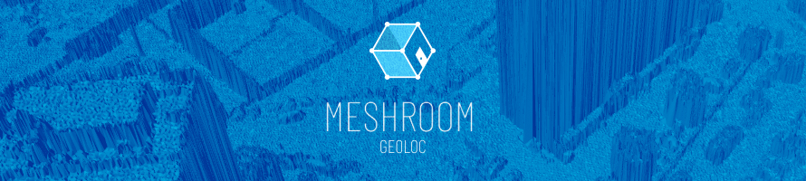
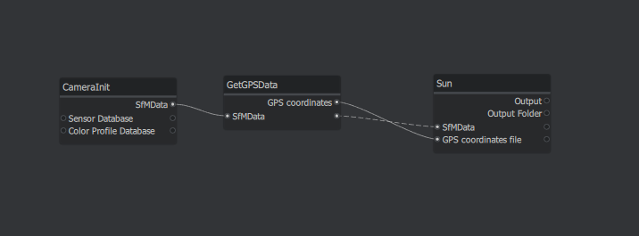
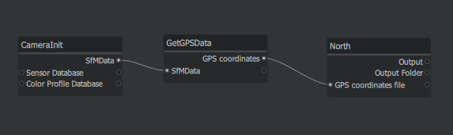
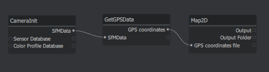
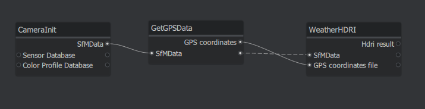
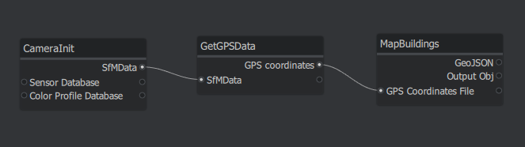
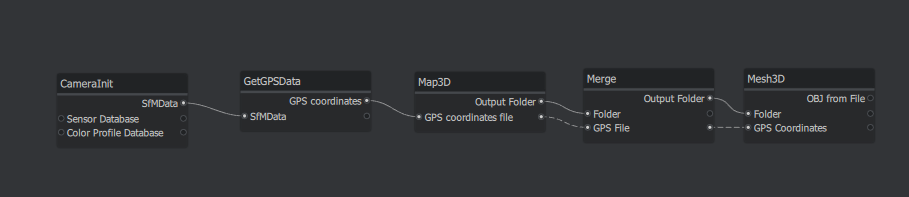
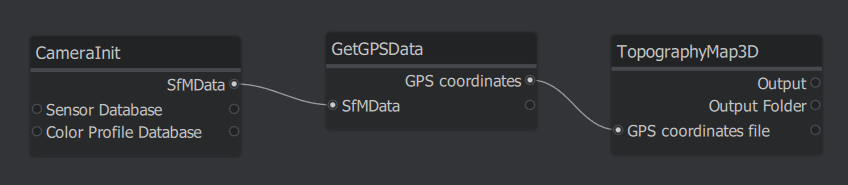

# Meshroom Geolocation



[Meshroom](https://alicevision.org/#meshroom) is a 3D Reconstruction Software using Photogrammetry
Meshroom Geoloc is a group of nodes using the GPS data of the pictures to geolocate and replace the object in his geographical context. From the gps data of your camera you can create and export 2d Map, 2d Map with extrude buildings, elevation and 3d map. 

{Worldwide} The 2D map uses Open Street Map and worldwide data. 
{Worldwide} The 2D map with buildings uses Open Street Map Building.
{Worldwide} The elevation map comes from NASA Data with a resolution of 30 meters.
{France}    The 3D map comes from IGN (The french geographical institute) with a resolution of 25 meters, 5 meters, 1 meters and 30 centimeters for the lidar HD program.

## Install
It is a module for [Meshroom](https://alicevision.org/#meshroom).

You can [download pre-compiled binaries for the latest release](https://github.com/alicevision/meshroom/releases).

Get the source code and install runtime requirements:
```bash
git clone --recursive https://github.com/alicevision/MeshroomGeolocation.git
cd MeshroomGeolocation
pip install -r requirements.txt
```
Custom nodes can be added to Meshroom by setting the environment variable `MESHROOM_NODES_PATH`.

Here `MESHROOM_NODES_PATH = path/to/MeshroomGeolocation`.

All the nodes will be in Geolocalisation category in Meshroom UI.

Custom pipelines can be added to Meshroom by setting the environment variable `MESHROOM_PIPELINE_TEMPLATES_PATH`.

Here `MESHROOM_PIPELINE_TEMPLATES_PATH = path/to/MeshroomGeolocation/pipelines`.

All the pipelines will be available in Pipelines category in Meshroom UI. You can learn more about them [here](#pipelines).

## Features
All nodes created by our team enable the following features :
- **GetGPSData** : It permits to get average GPS data of the dataset. It's useful for all the other features.
- **Map2D** : With this node, you can obtain a 2D map based on [Open Street Map](https://www.openstreetmap.fr/) data. It has several layers of information and a minimal radius precision of 30m.
- **MapBuildings** : The map obtained with this node shows the buildings extruded. It is also based on Open Street Map data.
- **TopographyMap3D** : As we have 2D and 2.5D, this node is good for a worldwide 3D map. It is based on data from NASA.
- **Map3D** : With this node, a 3D map can be generated, based on IGN data so it's only available for France. Different resolutions can be chosen between 30cm, 1m, 5m and 25m. Corresponding data are downloaded but needs a treatment (Merge and Mesh3D).
- **Merge** : A folder that contains .las or .asc files are merged into a single file to then generate a mesh.
- **Mesh3D** : After treatment, lidar file or ASCII file generates a 3D mesh.
- **North** : As north is not indicated on the maps generated, this node places it as a cone.
- **WeatherHDRI** : As sometimes weather information is needed, HDRI of the current weather of the dataset is downloaded.
- **Sun** : The position of the sun according when the dataset was taken is calculated with this node and represented as a big yellow sphere.

## Pipelines
Some pipelines are already existing to make the use of them easier.
Here are screenshots of them :
- Named **Generate Sun**, this pipeline can calculate the position of the sun and create a sphere representing it.



- **Generate North** permits to know where the north is.



- **Generate Map** is all about getting the 2d map you want, with the layers desired.



- **Generate Weather H D R I** is also a simple node with an HDRI downloaded for the weather during the dataset.



- **Generate Map Buildings** is like for the map 2d, but instead with extruded buildings.



- **Generate_3D Map** is a longer pipeline to obtain a detailed 3d map (only available in France for now).



- **Generate Elevation Map** is available almost everywhere, based on SRTM data and generate a 3d mesh.




## Feedback
Do not hesitate to contact us or to give us some feedback.